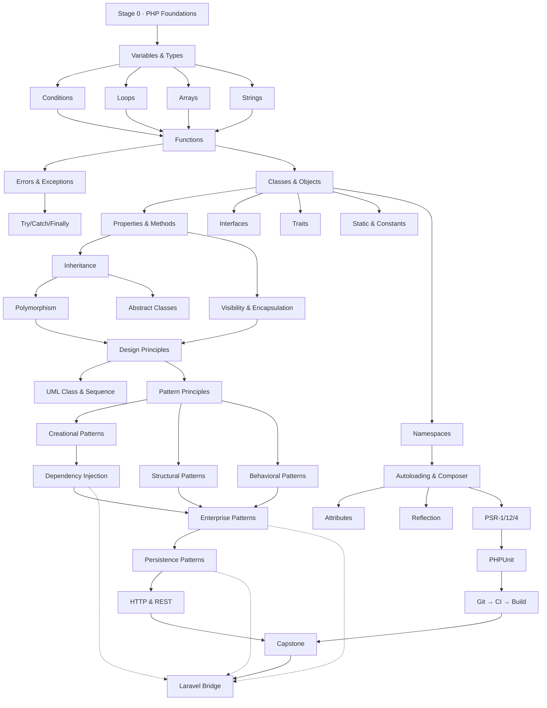

# 05 — Knowledge Map

## 1. Concept prerequisite graph

Rendered on `/path` and on every concept page ("learn this first" / "used later"). Stored in `concept_prerequisites`.

Solid edges = hard prerequisite (must be `practicing` or better before the target is unlocked).
Dashed edges = "used later in Laravel" (optional panel, never gating).

## 2. Stage gates

| Gate | Condition (checked by `MasteryEvaluator`) |
|---|---|
| Enter Stage 2 | Stage 0 quiz ≥ 80% AND 10 foundation exercises correct |
| Enter Stage 4 | concepts `inheritance`, `interface`, `trait`, `exception` ≥ `practicing` |
| Enter Stage 5 | `composition`, `encapsulation`, `coupling` ≥ `practicing` |
| Enter Stage 8 | `di`, `factory`, `strategy` ≥ `comfortable` |
| Enter Stage 9 | `namespace`, `autoloading` mastered; 1 PHPUnit exercise |
| Capstone | ≥ 60% of tracked concepts `comfortable`, ≥ 20% `mastered` |

## 3. Skill domains → concepts mapping (initial)

| Domain | Example concepts |
|---|---|
| php_syntax | `variables`, `constants`, `type_declarations`, `named_arguments` |
| variables | `scope`, `references`, `typed_properties` |
| data_types | `primitive_types`, `union_types`, `nullable_types`, `mixed` |
| conditions | `operators`, `match_expression` |
| loops | `foreach`, `iterators` |
| functions | `closures`, `arrow_functions`, `callbacks` |
| arrays | `indexed_arrays`, `associative_arrays`, `spl` |
| strings | `interpolation`, `heredoc` |
| files | `include_require`, `streams` |
| http | `request_response`, `sessions`, `cookies`, `rest` |
| oop | `class`, `inheritance`, `interface`, `trait`, `polymorphism`, `static`, `reflection`, `attributes`, `magic_methods` |
| exceptions | `exceptions`, `error_handling`, `error_patterns` |
| database | `pdo`, `data_mapper`, `identity_map`, `unit_of_work`, `transactions` |
| security | `input_validation`, `escaping`, `password_hashing`, `auth_flows` |
| testing | `phpunit`, `assertions`, `mocks`, `tdd` |
| modern_php | `enums`, `readonly`, `property_hooks`, `fibers`, `composer2`, `static_analysis` |

## 4. PHP → Laravel bridge (optional panels)

| Core PHP (this book) | Laravel equivalent | Where it appears |
|---|---|---|
| PHP classes / constructor promotion | Controllers, Services, Models | Stage 2 panel |
| Interfaces | `Illuminate\Contracts\*` | Stage 2 / 5 |
| Dependency Injection (Ch 9) | Service Container & method injection | Stage 5 |
| Namespaces (Ch 5) | `App\` structure, PSR-4 | Stage 3 |
| Autoload + Composer (Ch 5/16) | `composer.json`, package discovery | Stage 3/9 |
| Exceptions (Ch 4) | `app/Exceptions`, report/render | Stage 2 |
| Front Controller (Ch 12) | `public/index.php` + router | Stage 8 |
| Application Controller / Page Controller (Ch 12) | `Route` + Controller | Stage 8 |
| Template View + View Helper (Ch 12) | Blade + View Composers | Stage 8 |
| Transaction Script vs Domain Model (Ch 12) | Eloquent vs Service layer | Stage 8 |
| Data Mapper / Unit of Work / Identity Map (Ch 13) | Eloquent ORM internals | Stage 8 |
| Registry (Ch 12) | Facades / container singletons (with caution note) | Stage 8 |
| Observer (Ch 11) | Model events, `EventServiceProvider` | Stage 7 |
| Strategy (Ch 11) | Driver pattern in config | Stage 7 |
| Command (Ch 11) | Jobs & Queues | Stage 7 |
| PSR-4 (Ch 15) | autoload config | Stage 9 |
| PHPUnit (Ch 18) | `php artisan test`, Pest | Stage 9 |
| CI (Ch 21) | GitHub Actions workflow | Stage 10 |

## 5. "Why am I learning this?" affordances

- Each lesson header shows: prerequisites (with status chips) and `used_in` (later concepts/lessons).
- Each concept page shows an in-degree/out-degree mini-map.
- The `/path` screen renders the whole graph with mastered nodes highlighted and the next recommended node pulsing.
- Data source: `concept_prerequisites` + `lesson_concepts(role)`; no hard-coded graph in views.
