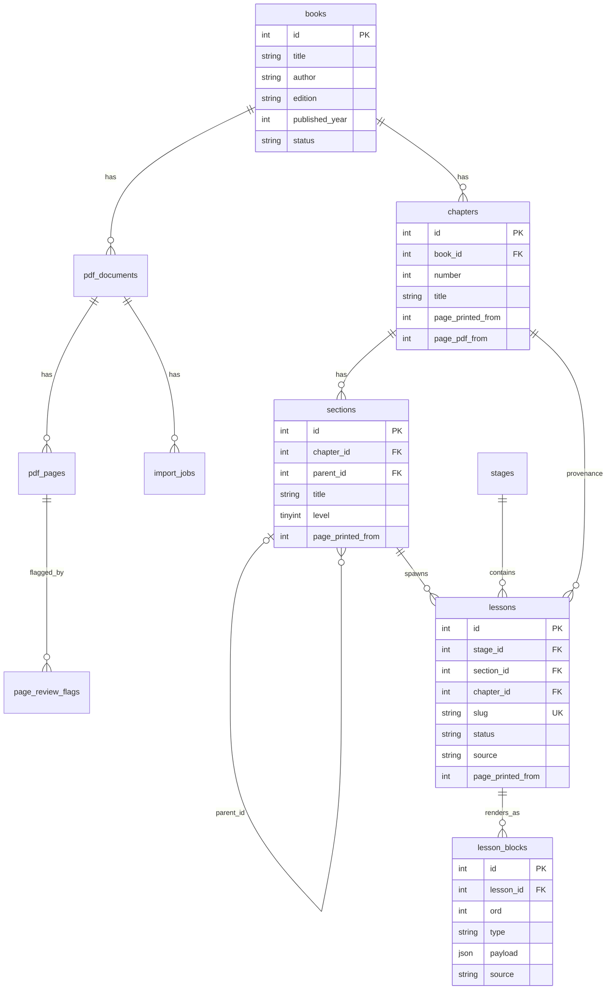
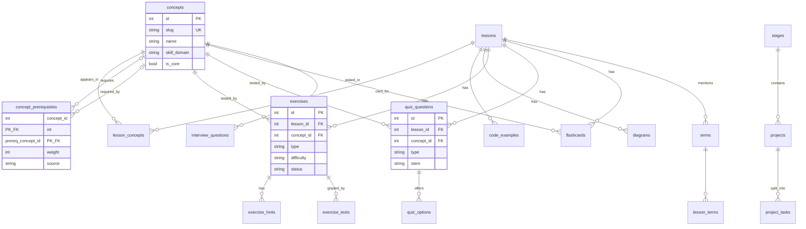
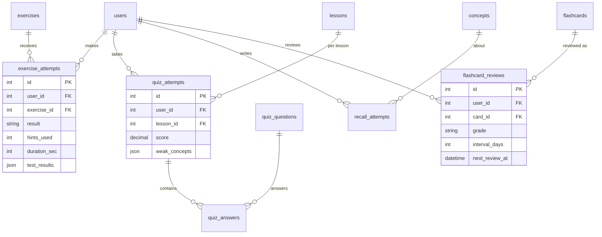
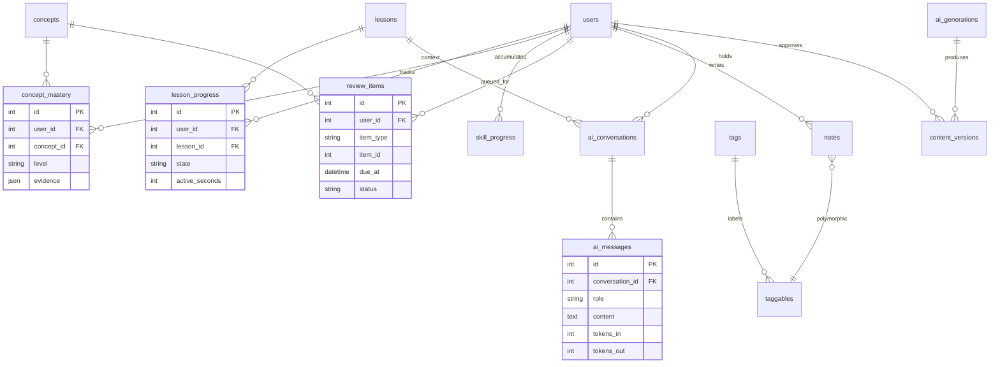

# 07 — Entity Relationship Diagrams

Mermaid `erDiagram` renders in the `/admin` schema page and in GitHub. Split by module to stay readable.

## 1. Source & content tree

## 2. Concepts & learning assets

## 3. Practice & attempts

## 4. Progress, notes, AI

## Relationship rules

| Relationship | On delete |
|---|---|
| `lessons → lesson_blocks` | cascade (hard delete) |
| `lessons → exercises/quiz/flashcards` | soft delete lesson → children stay but hidden |
| `exercises → hints/tests` | cascade |
| `quiz_questions → options` | cascade |
| `users → attempts/progress/notes` | cascade |
| `sections → lessons` | restrict if published children |
| `concepts → prerequisites` | cascade both directions (service cleans orphans) |
