# 09 — Flows

All diagrams are Mermaid; they render on `/path`, in docs, and in the admin help pages.

## 1. Book import (admin, Phase 1)

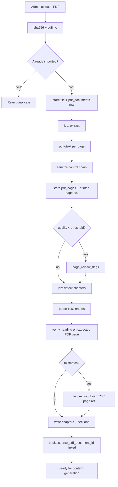

## 2. AI content generation (Pipeline A, Phase 7)

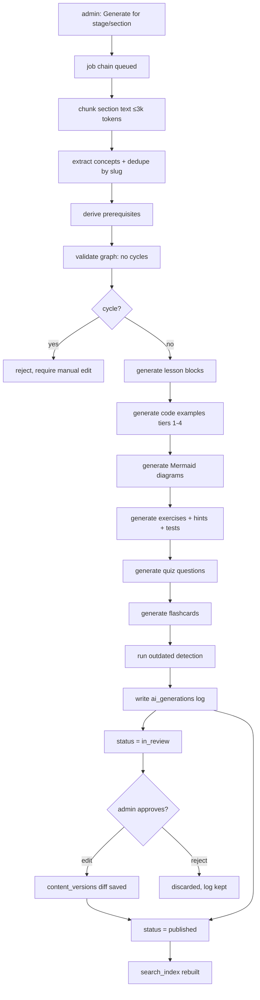

Idempotency: each job hashes `(stage, prompt_version, input_chunk)`; re-runs skip completed work.

## 3. Learner opens a lesson (must not call AI)

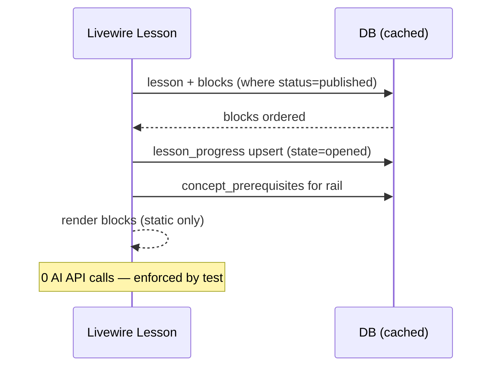

## 4. Learning loop (one lesson)

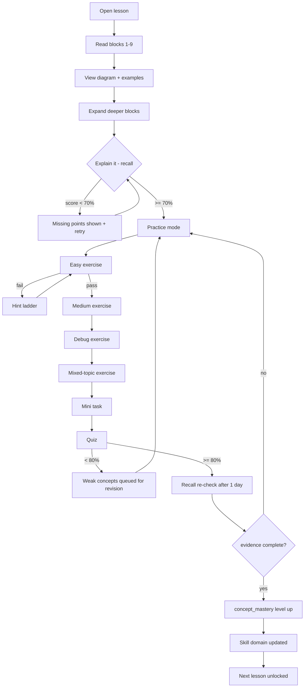

## 5. Exercise attempt with hint ladder

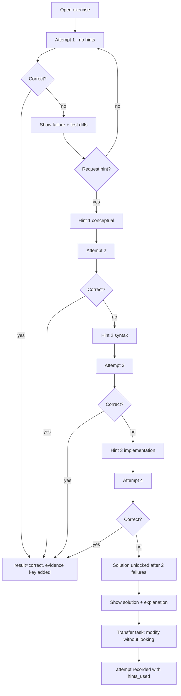

## 6. Quiz flow

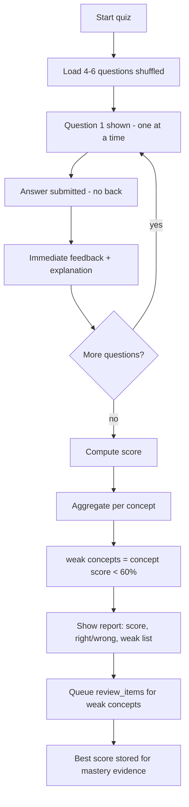

## 7. Mastery state machine

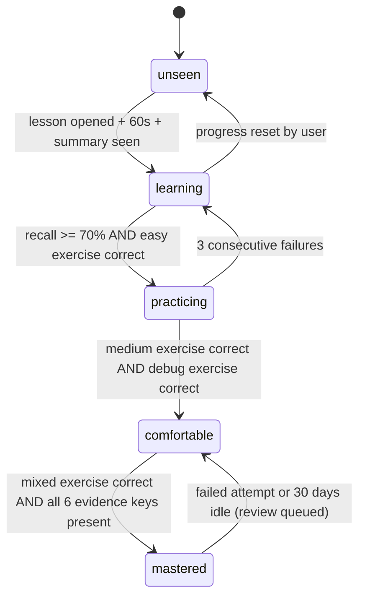

## 8. Spaced review

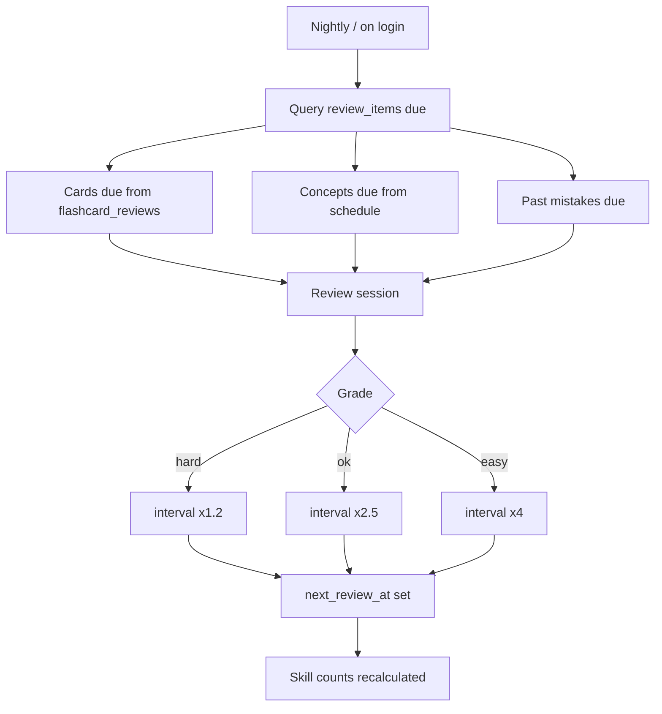

## 9. AI tutor (Pipeline B) — hint ladder policy

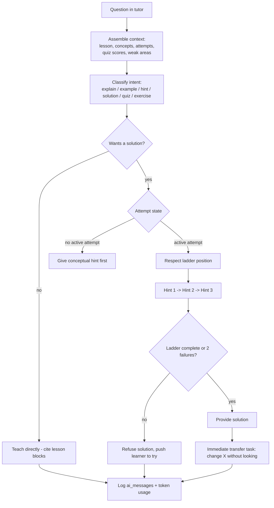

## 10. Global search

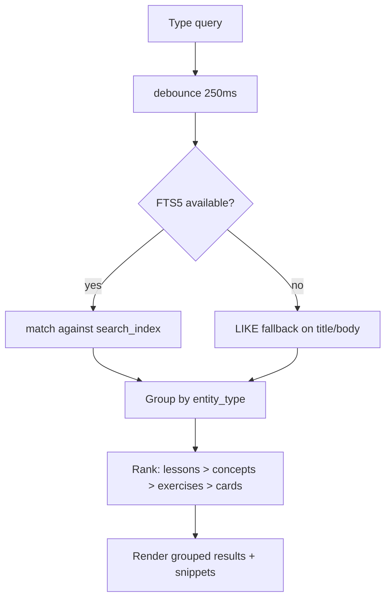

## 11. Admin publish gate

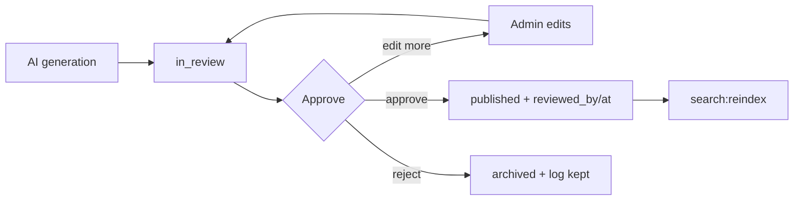

## 12. Code execution (Phase 8, sandboxed service)

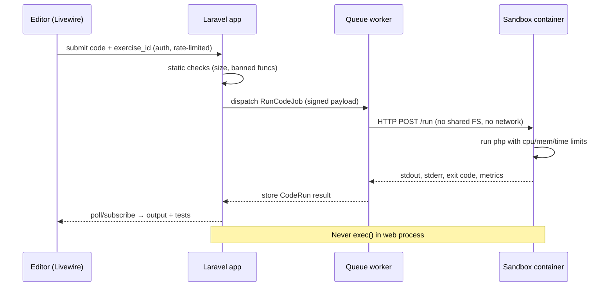
